<div align="center">
  
</div>

<br/>

<table align="center" width="100%">
<tr>
<td width="55%" valign="top">

### About

Second-year MSc student in Intelligent Computer Systems at USTHB.

I enjoy building software from end to end, from designing and implementing applications to solving real-world problems with code. My current interests include artificial intelligence, machine learning, deep learning, natural language processing (NLP), and cybersecurity.

</td>
<td width="45%" valign="top">

### Focus

```text
neural networks     [##########--------]
nlp / transformers  [########----------]
full-stack dev      [#############-----]
mlops & deployment  [######------------]
```

</td>
</tr>
</table>

<div align="center">
  
</div>

### Stack

<div align="center">


</div>

<div align="center">
  
</div>

### Contact

<div align="center">
  <br/>
  <a href="https://linkedin.com/in/mariahalli"></a>
  &nbsp;&nbsp;
  <a href="mailto:mariahlli@email.com"></a>
  &nbsp;&nbsp;
  <a href="https://github.com/mariahlli"></a>
  <br/><br/>
  <sub>Open to internships and research collaborations in AI/ML.</sub>
  <br/>
</div>
